# Отчет по практической работе №2

**Выполнил:** Студент группы БСБО-09-23  
**ФИО:** Самсонова Ольга Павловна  
**Дисциплина:** Разработка мобильных приложений 

---

## 1. Цель работы
Изучить концепцию жизненного цикла Activity в Android. Научиться работать с явными и неявными намерениями (Intents) для передачи данных и вызова системных приложений. Освоить механизмы взаимодействия с пользователем: системные уведомления (Notifications), всплывающие сообщения (Toast, Snackbar) и диалоговые окна (модальные окна, выбор даты/времени, индикация загрузки).

## 2. Архитектура проекта
Создан мульти-модульный проект, включающий в себя следующие изолированные компоненты (модули):
1. **`ActivityLifecycle`** — Логирование и изучение стадий жизненного цикла активности.
2. **`MultiActivity`** — Явные намерения (передача данных между экранами).
3. **`IntentFilter`** — Неявные намерения (открытие браузера, отправка данных в другие приложения).
4. **`NotificationApp`** — Создание системных уведомлений и каналов.
5. **`Dialog`** — Работа с фрагментами диалогов (`AlertDialog`, `TimePicker`, `DatePicker`, `ProgressDialog`).

---

## 3. Ход работы

### 3.1. Модуль `ActivityLifecycle` — Жизненный цикл 
Сначала в классе `MainActivity` были переопределены все основные методы жизненного цикла (`onStart`, `onResume`, `onPause`, `onStop`, `onDestroy`, `nRestart`). Внутрь каждого метода был добавлен вывод системного сообщения с помощью класса `Log.i`, чтобы отслеживать состояние приложения в консоли.

Далее в разметку `activity_main.xml` было добавлено поле ввода `EditText`. Это было сделано для проверки сохранения состояния пользовательского интерфейса. Я ввела текст в поле, после чего нажала системную кнопку "Home" (Свернуть). В консоли `LogCat` зафиксировался вызов методов `onPause()`, `onStop()` и `onSaveInstanceState()`. После возврата в приложение текст в поле сохранился, а в консоли вызвались `onStart()` и `onResume()`.

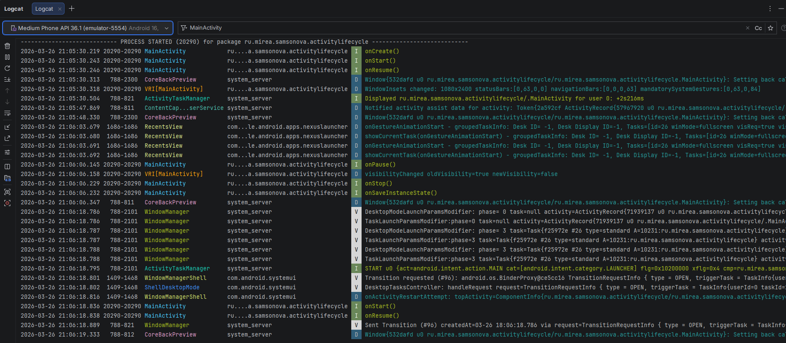
*Рисунок 1: Окно Logcat с отработкой методов жизненного цикла.* 

**Листинг переопределения методов в `MainActivity.java`:**
```java
@Override
    protected void onStart(){
        super.onStart();
        Log.i(TAG, "onStart()");
    }

    @Override
    protected void onRestoreInstanceState(@NonNull Bundle savedInstanceState) {
        super.onRestoreInstanceState(savedInstanceState);
        Log.i(TAG, "onRestoreInstanceState()");
    }

    @Override
    protected void onResume() {
        super.onResume();
        Log.i(TAG, "onResume()");
    }

    @Override
    protected void onPause() {
        super.onPause();
        Log.i(TAG, "onPause()");
    }

    @Override
    protected void onSaveInstanceState(@NonNull Bundle outState) {
        super.onSaveInstanceState(outState);
        Log.i(TAG, "onSaveInstanceState()");
    }

    @Override
    protected void onStop() {
        super.onStop();
        Log.i(TAG, "onStop()");
    }

    @Override
    protected void onDestroy() {
        super.onDestroy();
        Log.i(TAG, "onDestroy()");
    }
```

---

### 3.2. Модуль `MultiActivity` — Явные намерения 
Сначала была создана разметка главного экрана с кнопкой "Отправить данные". Затем с помощью менеджера Android Studio была сгенерирована вторая активность — `SecondActivity`, куда был добавлен текстовый элемент `TextView` для приема данных.

В коде MainActivity был реализован обработчик нажатия на кнопку. Внутри него был создан объект явного намерения `Intent`, жестко связывающий текущий класс с классом `SecondActivity`. Для передачи ФИО студента использовался метод `putExtra()`.

**Код вызова второй активности (`MainActivity.java`):**
```java
        EditText editText = findViewById(R.id.editTextData);
        Button btnSend = findViewById(R.id.btnSend);

        btnSend.setOnClickListener(new View.OnClickListener() {
            @Override
            public void onClick(View v) {

                String textToSend = editText.getText().toString();

                Intent intent = new Intent(MainActivity.this, SecondActivity.class);

                intent.putExtra("key", "MIREA - Самсонова Ольга Павловна, " + textToSend);

                startActivity(intent);
            }
        });
```
 
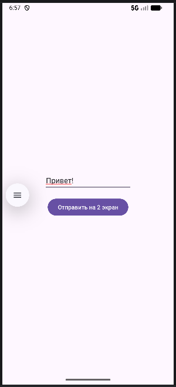  
*Рисунок 2: Главный экран модуля с заполненным полем ввода.*   

Затем, во второй активности в методе onCreate был вызван метод `getIntent().getStringExtra()`, который успешно извлек переданные данные и поместил их в `TextView`.
 
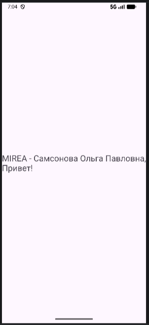  
*Рисунок 3: Вторая активность с успешно переданными данными.* 

---

### 3.3. Модуль `IntentFilter` — Неявные намерения 
Задача заключалась в передаче данных не конкретной активности, а операционной системе, чтобы она сама подобрала подходящее приложение.

Было создано приложение, которое взаимодействует с операционной системой, делегируя задачи другим приложениям через неявные намерения. В `activity_main.xml` были реализованы две кнопки:
1. Открытие веб-сайта МИРЭА (используется `ACTION_VIEW` и парсинг URI).
2. Поделиться данными (используется `ACTION_SEND` для вызова системного меню отправки текста).

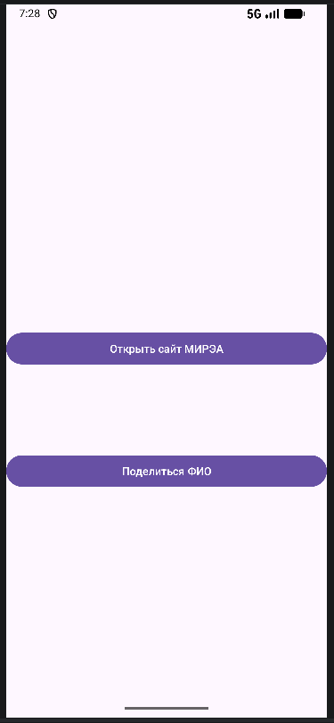  
*Рисунок 4: Кнопки в приложении.*

**Код неявных намерений (`MainActivity.java`):**
```java
        Button btnOpenWeb = findViewById(R.id.btnOpenWeb);
        Button btnShare = findViewById(R.id.btnShare);

        btnOpenWeb.setOnClickListener(new View.OnClickListener() {
            @Override
            public void onClick(View v) {
                Uri address = Uri.parse("https://www.mirea.ru/");
                Intent openLinkIntent = new Intent(Intent.ACTION_VIEW, address);
                startActivity(openLinkIntent);
            }
        });

        btnShare.setOnClickListener(new View.OnClickListener() {
            @Override
            public void onClick(View v) {
                Intent shareIntent = new Intent(Intent.ACTION_SEND);
                shareIntent.setType("text/plain");
                shareIntent.putExtra(Intent.EXTRA_SUBJECT, "MIREA");
                shareIntent.putExtra(Intent.EXTRA_TEXT, "Самсонова Ольга Павловна");

                startActivity(Intent.createChooser(shareIntent, "Мои ФИО"));
            }
        });
```

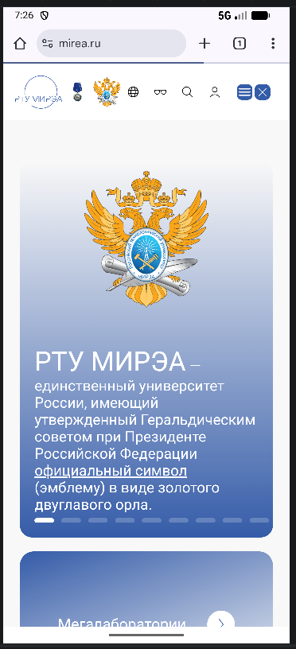  
*Рисунок 5: Открытый браузер по нажатию на кнопку.*  
 
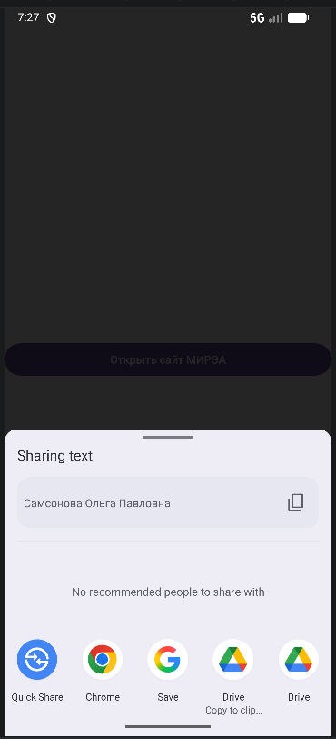    
*Рисунок 6: Системное окно выбора приложения ("Поделиться").* 

---

### 3.4. Модуль `NotificationApp` — Системные уведомления 
Для реализации уведомлений потребовалось учесть политики безопасности новых версий Android. Сначала в файл `AndroidManifest.xml` было добавлено разрешение `<uses-permission android:name="android.permission.POST_NOTIFICATIONS" />`. В методе `onCreate` была написана проверка: если разрешение еще не выдано, система запрашивает его у пользователя.

После получения прав был создан метод генерации уведомления. Для совместимости с Android 8.0+ был предварительно зарегистрирован канал уведомлений (`NotificationChannel`). Само уведомление конструировалось через `NotificationCompat`.Builder, где для отображения развернутой информации (ФИО и группа) был применен стиль `BigTextStyle`.

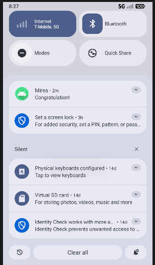    
*Рисунок 7: Уведомление в верхней шторке системы.* 

**Код генерации уведомления:**
```java
public void onClickSendNotification(View view) {
        if (ActivityCompat.checkSelfPermission(this, Manifest.permission.POST_NOTIFICATIONS) != PackageManager.PERMISSION_GRANTED) {
            return;
        }

        NotificationCompat.Builder builder = new NotificationCompat.Builder(this, CHANNEL_ID)
                .setContentText("Congratulation!")
                .setSmallIcon(R.drawable.ic_launcher_foreground)
                .setPriority(NotificationCompat.PRIORITY_HIGH)
                .setStyle(new NotificationCompat.BigTextStyle()
                        .bigText("Much longer text that cannot fit one line..."))
                .setContentTitle("Mirea");

        NotificationManagerCompat notificationManager = NotificationManagerCompat.from(this);

        if (Build.VERSION.SDK_INT >= Build.VERSION_CODES.O) {
            NotificationChannel channel = new NotificationChannel(CHANNEL_ID, "Samsonova Olga Pavlovna Notification", NotificationManager.IMPORTANCE_DEFAULT);
            channel.setDescription("MIREA Channel");
            notificationManager.createNotificationChannel(channel);
        }

        notificationManager.notify(1, builder.build());
    }
```


---

### 3.5. Модуль `Dialog` — Модальные окна 
В модуле было реализовано 4 типа диалоговых окон с использованием классов, наследуемых от `DialogFragment`. Для взаимодействия пользователя с окнами применяются методы обратного вызова и компоненты `Toast` / `Snackbar`.

1. **`AlertDialog` (Обычный диалог):** Окно с тремя кнопками (Иду дальше, Пауза, Нет), построенное через паттерн `Builder`. Вызывает `Toast`.
2. **`TimePickerDialog`:** Системное окно выбора времени. Возвращает часы и минуты.
3. **`DatePickerDialog`:** Системный календарь. Возвращает выбранную дату.
4. **`ProgressDialog`:** Модальное окно загрузки с анимированным индикатором (Indeterminate).

**Обработка выбора даты и использование `Snackbar` (`MainActivity.java`):**
```java
public void onDateSet(int year, int month, int dayOfMonth) {
    String text = "Вы выбрали дату: " + dayOfMonth + "." + (month + 1) + "." + year;
    Snackbar.make(findViewById(android.R.id.content), text, Snackbar.LENGTH_LONG).show();
}
```

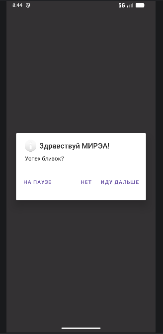    
*Рисунок 8: Классическое окно AlertDialog с кнопками.* 
  
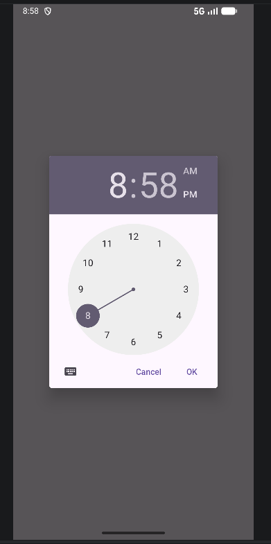    
*Рисунок 9: Окно выбора времени (TimePicker).*

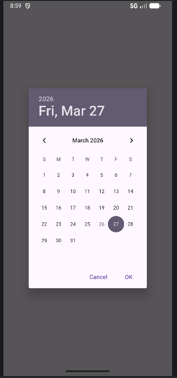      
*Рисунок 10: Окно выбора даты (DatePicker).*  

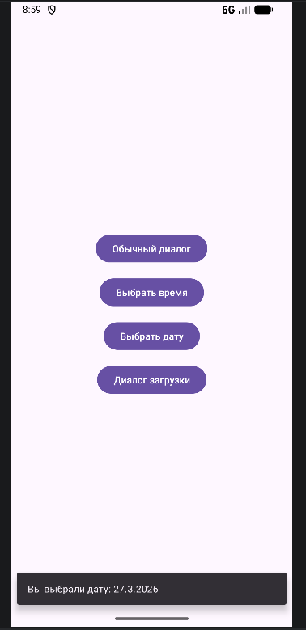       
*Рисунок 11: Всплывающий внизу экрана Snackbar.* 
 
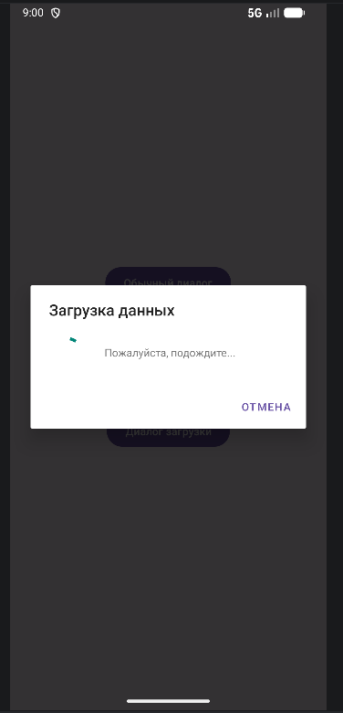   
*Рисунок 12: Диалоговое окно загрузки (ProgressDialog).* 

---

## 4. Результаты работы 
Практическая работа выполнена в полном объеме. В процессе разработки:
* Закреплено понимание жизненного цикла `Activity` и особенностей поведения приложения при сворачивании и возврате из фона.
* Успешно реализована навигация и передача данных между активностями (явные `Intents`), а также переиспользование системных функций (неявные `Intents`).
* Изучены политики безопасности Android 13+ на примере запроса разрешений для показа уведомлений.
* Получен практический опыт создания кастомных диалоговых окон и интеграции современного UI-элемента `Snackbar` для обратной связи с пользователем.
