# Отчет по практической работе №3

**Выполнил:** Студент группы БСБО-09-23
**ФИО:** Самсонова Ольга Павловна
**Дисциплина:** Разработка мобильных приложений

---

## 1. Цель работы

Изучить механизм работы намерений (Intent) в Android-приложениях, научиться передавать данные между активностями, использовать неявные намерения для вызова системных и сторонних приложений, освоить получение результата от другой активности с помощью Activity Result API, а также изучить основы работы с фрагментами (Fragment) и адаптацией интерфейса под изменение ориентации экрана. Дополнительно закрепить навыки работы с шаблоном Navigation Drawer Activity при создании отдельного проекта с экраном данных и встроенным WebView.

---

## 2. Архитектура проекта

В ходе выполнения практической работы был создан мульти-модульный проект, включающий несколько независимых учебных модулей, каждый из которых демонстрирует отдельный сценарий работы Android-приложения.

В проект были включены следующие модули:

1. **IntentApp** — модуль для изучения явных намерений и передачи данных между двумя активностями.
2. **Sharer** — модуль для изучения отправки данных через неявные намерения, обработки ACTION_SEND и получения результата от действий выбора данных.
3. **FavoriteBook** — модуль для передачи данных между двумя активностями с возвратом результата на главный экран.
4. **SystemIntentsApp** — модуль для вызова системных приложений: номеронабирателя, браузера и карт.
5. **SimpleFragmentApp** — модуль для изучения фрагментов, переключения фрагментов в портретной ориентации и одновременного отображения двух фрагментов в горизонтальной ориентации.
6. **MireaProject** — отдельный проект, созданный на основе шаблона Navigation Drawer Activity, в который были добавлены DataFragment и WebViewFragment.

---

## 3. Ход работы

### 3.1. Модуль IntentApp — передача данных между активностями

Сначала был создан новый модуль IntentApp типа Empty Activity. После этого в проект была добавлена вторая активность SecondActivity. Основная задача данного модуля заключалась в том, чтобы получить текущее системное время в первой активности, вычислить квадрат номера по списку и передать оба значения во вторую активность. Во второй активности требовалось отобразить текстовое сообщение в формате, заданном методическими указаниями.

В классе MainActivity был реализован метод обработки нажатия на кнопку. Внутри него сначала определялось текущее время в миллисекундах с помощью System.currentTimeMillis(), затем время форматировалось в строку через SimpleDateFormat. После этого вычислялся квадрат номера по списку. Далее создавался объект явного намерения Intent, связывающий текущую активность с SecondActivity, и оба значения передавались с помощью метода putExtra().


**Рисунок 1: Главный экран модуля IntentApp с кнопкой перехода ко второй активности.**
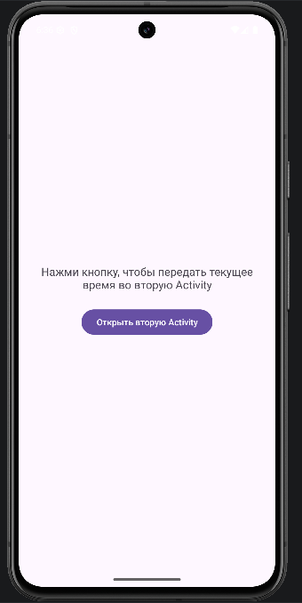


**Листинг `MainActivity.java`:**
```java
package com.mirea.Samsonova.intentapp;

import android.content.Intent;
import android.os.Bundle;
import android.view.View;

import androidx.appcompat.app.AppCompatActivity;

import java.text.SimpleDateFormat;
import java.util.Date;
import java.util.Locale;

public class MainActivity extends AppCompatActivity {

    private static final int GROUP_LIST_NUMBER = 20;

    @Override
    protected void onCreate(Bundle savedInstanceState) {
        super.onCreate(savedInstanceState);
        setContentView(R.layout.activity_main);
    }

    public void openSecondActivity(View view) {
        long dateInMillis = System.currentTimeMillis();
        String format = "yyyy-MM-dd HH:mm:ss";
        final SimpleDateFormat sdf = new SimpleDateFormat(format, Locale.getDefault());
        String dateString = sdf.format(new Date(dateInMillis));

        int square = GROUP_LIST_NUMBER * GROUP_LIST_NUMBER;

        Intent intent = new Intent(this, SecondActivity.class);
        intent.putExtra("current_time", dateString);
        intent.putExtra("number_square", square);
        startActivity(intent);
    }
}
```

В классе получаются время, квадрат номера и выполняется запуск второй активности.

Во второй активности в методе onCreate() был получен объект Intent, с помощью которого были извлечены переданные данные. После извлечения строки времени и целочисленного значения квадрата номера была сформирована итоговая строка, которая выводилась в элемент TextView.

**Рисунок 2: Экран SecondActivity с отображением квадрата номера по списку и текущего времени.**
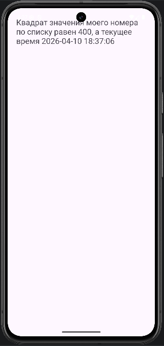

**Листинг `SecondActivity.java`:**
```java
package com.mirea.Samsonova.intentapp;

import android.content.Intent;
import android.os.Bundle;
import android.widget.TextView;

import androidx.appcompat.app.AppCompatActivity;

public class SecondActivity extends AppCompatActivity {

    private TextView textViewResult;

    @Override
    protected void onCreate(Bundle savedInstanceState) {
        super.onCreate(savedInstanceState);
        setContentView(R.layout.activity_second);

        textViewResult = findViewById(R.id.textViewResult);

        Intent intent = getIntent();
        String time = intent.getStringExtra("current_time");
        int square = intent.getIntExtra("number_square", 0);

        String result = "Квадрат значения моего номера по списку равен "
                + square + ", а текущее время " + time;

        textViewResult.setText(result);
    }
}
```
В этом классе принимаются и отображаются переданные данные.

Для интерфейса главной активности была создана разметка с текстовой подсказкой и кнопкой, а для второй активности — разметка с TextView, занимающим основную часть экрана.


**Файл `activity_main.xml`:**
```xml
<?xml version="1.0" encoding="utf-8"?>
<LinearLayout xmlns:android="http://schemas.android.com/apk/res/android"
    android:layout_width="match_parent"
    android:layout_height="match_parent"
    android:gravity="center"
    android:orientation="vertical"
    android:padding="24dp">

    <TextView
        android:layout_width="wrap_content"
        android:layout_height="wrap_content"
        android:layout_marginBottom="24dp"
        android:text="Нажми кнопку, чтобы передать текущее время во вторую Activity"
        android:textAlignment="center"
        android:textSize="18sp" />

    <Button
        android:layout_width="wrap_content"
        android:layout_height="wrap_content"
        android:onClick="openSecondActivity"
        android:text="Открыть вторую Activity" />

</LinearLayout>
```


**Файл `activity_second.xml`:**
```xml
<?xml version="1.0" encoding="utf-8"?>
<ScrollView xmlns:android="http://schemas.android.com/apk/res/android"
    android:layout_width="match_parent"
    android:layout_height="match_parent">

    <TextView
        android:id="@+id/textViewResult"
        android:layout_width="match_parent"
        android:layout_height="wrap_content"
        android:padding="24dp"
        android:textSize="22sp" />

</ScrollView>
```

Таким образом, в данном модуле была реализована передача простых данных между двумя экранами с использованием явного Intent, что соответствует заданию на передачу времени и отображение результата во второй активности.

---

### 3.2. Модуль Sharer — отправка и получение данных через неявные намерения

Следующим этапом был создан модуль Sharer, посвящённый обмену данными между приложениями. В этом модуле решались две основные задачи: передача текста во внешнее приложение при помощи ACTION_SEND и получение данных через собственную ShareActivity, зарегистрированную в манифесте как обработчик неявного намерения. Кроме того, здесь был реализован выбор данных через ACTION_PICK с обработкой результата через Activity Result API.

Сначала в модуле была создана вторая активность ShareActivity. Затем в AndroidManifest.xml для этой активности был добавлен intent-filter, позволяющий приложению принимать действия ACTION_SEND с MIME-типами text/plain и image/*.

**Рисунок 3: Главный экран модуля.**
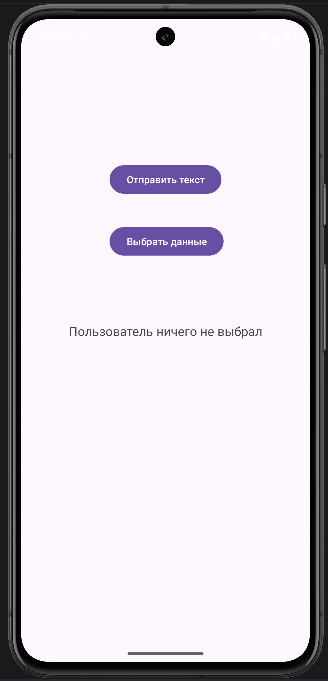


**Файл `AndroidManifest.xml`:**
```xml
<?xml version="1.0" encoding="utf-8"?>
<manifest xmlns:android="http://schemas.android.com/apk/res/android">

    <application
        android:allowBackup="true"
        android:icon="@mipmap/ic_launcher"
        android:label="@string/app_name"
        android:roundIcon="@mipmap/ic_launcher_round"
        android:supportsRtl="true"
        android:theme="@style/Theme.Lesson3">
        <activity
            android:name=".ShareActivity"
            android:exported="false" />
        <activity
            android:name=".MainActivity"
            android:exported="true">
            <intent-filter>
                <action android:name="android.intent.action.MAIN" />

                <category android:name="android.intent.category.LAUNCHER" />

                <action android:name="android.intent.action.SEND" />

                <category android:name="android.intent.category.DEFAULT" />

                <data android:mimeType="text/plain" />
                <data android:mimeType="image/*" />
            </intent-filter>
        </activity>
    </application>

</manifest>
```

В MainActivity были реализованы две кнопки. Первая кнопка запускала системный chooser для отправки текста "Mirea" через Intent.ACTION_SEND. Вторая кнопка запускала действие выбора данных ACTION_PICK, а результат выбора обрабатывался через объект ActivityResultLauncher.


**Листинг `MainActivity.java`:**
```java
package com.mirea.Samsonova.sharer;

import android.app.Activity;
import android.content.Intent;
import android.os.Bundle;
import android.view.View;
import android.widget.TextView;

import androidx.activity.result.ActivityResult;
import androidx.activity.result.ActivityResultCallback;
import androidx.activity.result.ActivityResultLauncher;
import androidx.activity.result.contract.ActivityResultContracts;
import androidx.appcompat.app.AppCompatActivity;

public class MainActivity extends AppCompatActivity {

    private ActivityResultLauncher<Intent> activityResultLauncher;
    private TextView textViewPickedData;

    @Override
    protected void onCreate(Bundle savedInstanceState) {
        super.onCreate(savedInstanceState);
        setContentView(R.layout.activity_main);

        textViewPickedData = findViewById(R.id.textViewPickedData);

        ActivityResultCallback<ActivityResult> callback = new ActivityResultCallback<ActivityResult>() {
            @Override
            public void onActivityResult(ActivityResult result) {
                if (result.getResultCode() == Activity.RESULT_OK && result.getData() != null) {
                    String dataString = result.getData().getDataString();
                    if (dataString == null) {
                        dataString = "URI не получен";
                    }
                    textViewPickedData.setText("Полученные данные: " + dataString);
                } else {
                    textViewPickedData.setText("Пользователь ничего не выбрал");
                }
            }
        };

        activityResultLauncher = registerForActivityResult(
                new ActivityResultContracts.StartActivityForResult(),
                callback
        );
    }

    public void onShareText(View view) {
        Intent intent = new Intent(Intent.ACTION_SEND);
        intent.setType("text/plain");
        intent.putExtra(Intent.EXTRA_TEXT, "Mirea");
        startActivity(Intent.createChooser(intent, "Выбор за вами!"));
    }

    public void onPickData(View view) {
        Intent intent = new Intent(Intent.ACTION_PICK);
        intent.setType("*/*");
        activityResultLauncher.launch(intent);
    }
}
```

После запуска отправки текста система отображала окно выбора приложения. Пользователь мог выбрать, например, Gmail, сообщения или собственную ShareActivity, если она подходила под фильтр.

**Рисунок 4: Системное окно выбора приложения после отправки текста из модуля Sharer.**
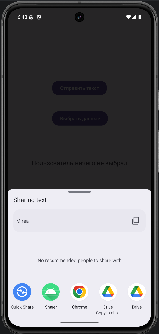

В классе ShareActivity в методе onCreate() происходил анализ входящего намерения. Если действие соответствовало ACTION_SEND, а тип данных был text/plain, то из намерения извлекался текст по ключу Intent.EXTRA_TEXT и выводился в TextView. Если же тип начинался с image/, отображалось сообщение о готовности приложения принимать изображения.

**Листинг `ShareActivity.java`:**
```java
package com.mirea.Samsonova.sharer;

import android.content.Intent;
import android.os.Bundle;
import android.widget.TextView;

import androidx.appcompat.app.AppCompatActivity;

public class ShareActivity extends AppCompatActivity {

    private TextView textViewSharedData;

    @Override
    protected void onCreate(Bundle savedInstanceState) {
        super.onCreate(savedInstanceState);
        setContentView(R.layout.activity_share);

        textViewSharedData = findViewById(R.id.textViewSharedData);

        Intent intent = getIntent();
        String resultText = "Данные не получены";

        if (Intent.ACTION_SEND.equals(intent.getAction()) && intent.getType() != null) {
            String type = intent.getType();

            if ("text/plain".equals(type)) {
                String sharedText = intent.getStringExtra(Intent.EXTRA_TEXT);
                if (sharedText != null && !sharedText.isEmpty()) {
                    resultText = sharedText;
                }
            } else if (type.startsWith("image/")) {
                resultText = "Приложение готово принимать изображения";
            }
        }

        textViewSharedData.setText(resultText);
    }
}
```

**Рисунок 5: Экран ShareActivity после нажатия на кнопку "Выбрать данные".**
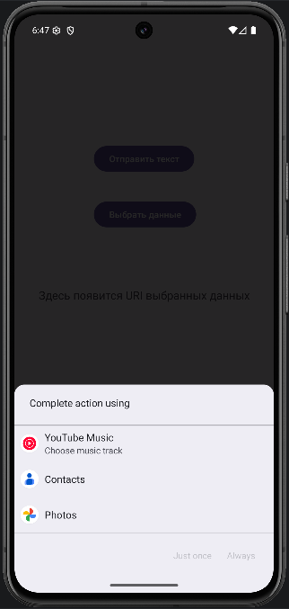

Также в MainActivity был реализован вывод URI выбранных пользователем данных после выполнения ACTION_PICK. Это значение отображалось в отдельном текстовом поле на главном экране.

**Рисунок 6: Экран MainActivity модуля Sharer с отображением URI выбранных данных.**
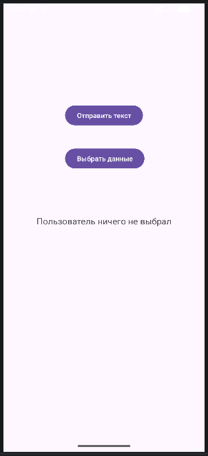

Для обоих экранов были созданы отдельные XML-разметки: первая содержала две кнопки и поле для вывода URI, вторая — TextView для отображения полученных данных.


**Файл `activity_main.xml`:**
```xml
<?xml version="1.0" encoding="utf-8"?>
<androidx.constraintlayout.widget.ConstraintLayout xmlns:android="http://schemas.android.com/apk/res/android"
    xmlns:app="http://schemas.android.com/apk/res-auto"
    xmlns:tools="http://schemas.android.com/tools"
    android:id="@+id/linearLayout"
    android:layout_width="match_parent"
    android:layout_height="match_parent"
    android:gravity="center_horizontal">

    <Button
        android:id="@+id/button"
        android:layout_width="wrap_content"
        android:layout_height="wrap_content"
        android:layout_marginTop="204dp"
        android:onClick="onShareText"
        android:text="Отправить текст"
        app:layout_constraintEnd_toEndOf="parent"
        app:layout_constraintStart_toStartOf="parent"
        app:layout_constraintTop_toTopOf="parent" />

    <Button
        android:id="@+id/button2"
        android:layout_width="wrap_content"
        android:layout_height="wrap_content"
        android:layout_marginTop="40dp"
        android:onClick="onPickData"
        android:text="Выбрать данные"
        app:layout_constraintEnd_toEndOf="parent"
        app:layout_constraintHorizontal_bias="0.506"
        app:layout_constraintStart_toStartOf="parent"
        app:layout_constraintTop_toBottomOf="@+id/button" />

    <TextView
        android:id="@+id/textViewPickedData"
        android:layout_width="wrap_content"
        android:layout_height="wrap_content"
        android:layout_marginTop="24dp"
        android:text="Здесь появится URI выбранных данных"
        android:textSize="18sp"
        app:layout_constraintBottom_toBottomOf="parent"
        app:layout_constraintEnd_toEndOf="parent"
        app:layout_constraintStart_toStartOf="parent"
        app:layout_constraintTop_toBottomOf="@+id/button2"
        app:layout_constraintVertical_bias="0.128" />

</androidx.constraintlayout.widget.ConstraintLayout>
```


**Файл `activity_share.xml`:**
```xml
<?xml version="1.0" encoding="utf-8"?>
<FrameLayout xmlns:android="http://schemas.android.com/apk/res/android"
    android:layout_width="match_parent"
    android:layout_height="match_parent"
    android:padding="24dp">

    <TextView
        android:id="@+id/textViewSharedData"
        android:layout_width="match_parent"
        android:layout_height="wrap_content"
        android:textSize="24sp" />

</FrameLayout>
```

В результате выполнения данного задания был реализован как сценарий отправки текста во внешнее приложение, так и сценарий обработки чужих намерений внутри собственного приложения, а также получение результата от другой активности через современный механизм Activity Result API.

---

### 3.3. Модуль FavoriteBook — передача данных и возврат результата

Следующим был создан модуль FavoriteBook, в котором требовалось реализовать приложение с двумя экранами. На первом экране должен был отображаться текст с любимой книгой пользователя, а на втором — выводиться любимая книга разработчика и поле ввода, куда пользователь мог ввести собственное название книги. После нажатия на кнопку введённая строка должна была возвращаться на первый экран и отображаться там.

В MainActivity был создан ActivityResultLauncher, который запускал вторую активность ShareActivity и принимал от неё результат. Перед запуском второй активности с помощью putExtra() передавалось название книги разработчика — "Преступление и наказание".


**Листинг `MainActivity.java`:**
```java
package com.mirea.Samsonova.favoritebook;

import android.app.Activity;
import android.content.Intent;
import android.os.Bundle;
import android.view.View;
import android.widget.TextView;

import androidx.activity.result.ActivityResult;
import androidx.activity.result.ActivityResultCallback;
import androidx.activity.result.ActivityResultLauncher;
import androidx.activity.result.contract.ActivityResultContracts;
import androidx.appcompat.app.AppCompatActivity;

public class MainActivity extends AppCompatActivity {

    public static final String KEY = "book_name";
    public static final String USER_MESSAGE = "MESSAGE";

    private ActivityResultLauncher<Intent> activityResultLauncher;
    private TextView textViewUserBook;

    @Override
    protected void onCreate(Bundle savedInstanceState) {
        super.onCreate(savedInstanceState);
        setContentView(R.layout.activity_main);

        textViewUserBook = findViewById(R.id.textViewBook);

        ActivityResultCallback<ActivityResult> callback = new ActivityResultCallback<ActivityResult>() {
            @Override
            public void onActivityResult(ActivityResult result) {
                if (result.getResultCode() == Activity.RESULT_OK && result.getData() != null) {
                    String userBook = result.getData().getStringExtra(USER_MESSAGE);
                    textViewUserBook.setText("Название Вашей любимой книги: " + userBook);
                }
            }
        };

        activityResultLauncher = registerForActivityResult(
                new ActivityResultContracts.StartActivityForResult(),
                callback
        );
    }

    public void getInfoAboutBook(View view) {
        Intent intent = new Intent(this, ShareActivity.class);
        intent.putExtra(KEY, "Преступление и наказание");
        activityResultLauncher.launch(intent);
    }
}
```

На первом экране располагался TextView с начальными словами о том, что здесь появится название любимой книги пользователя, а также кнопка, открывающая экран ввода данных.

**Рисунок 7: Главный экран модуля FavoriteBook до ввода данных пользователем.**
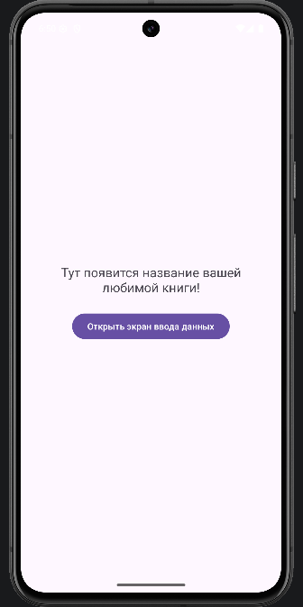

Во второй активности в onCreate() извлекалось значение, переданное из MainActivity, и отображалось в TextView как любимая книга разработчика. Также на этом экране располагался EditText для ввода книги пользователя и кнопка отправки результата.

При нажатии на кнопку создавался пустой Intent, в который помещался введённый текст. Затем этот Intent передавался в setResult(Activity.RESULT_OK, data), после чего активность завершалась методом finish().


**Листинг `ShareActivity.java`:**
```java
package com.mirea.Samsonova.favoritebook;

import android.app.Activity;
import android.content.Intent;
import android.os.Bundle;
import android.view.View;
import android.widget.EditText;
import android.widget.TextView;

import androidx.appcompat.app.AppCompatActivity;

public class ShareActivity extends AppCompatActivity {

    private TextView textViewDeveloperBook;
    private EditText editTextUserBook;

    @Override
    protected void onCreate(Bundle savedInstanceState) {
        super.onCreate(savedInstanceState);
        setContentView(R.layout.activity_share);

        textViewDeveloperBook = findViewById(R.id.textViewDeveloperBook);
        editTextUserBook = findViewById(R.id.editTextUserBook);

        Bundle extras = getIntent().getExtras();
        if (extras != null) {
            String developerBook = extras.getString(MainActivity.KEY);
            textViewDeveloperBook.setText("Любимая книга разработчика — " + developerBook);
        }
    }

    public void sendBookName(View view) {
        String text = editTextUserBook.getText().toString().trim();

        if (text.isEmpty()) {
            editTextUserBook.setError("Введите название книги");
            return;
        }

        Intent data = new Intent();
        data.putExtra(MainActivity.USER_MESSAGE, text);
        setResult(Activity.RESULT_OK, data);
        finish();
    }
}
```

**Рисунок 8: Экран ввода данных во второй активности модуля FavoriteBook.**
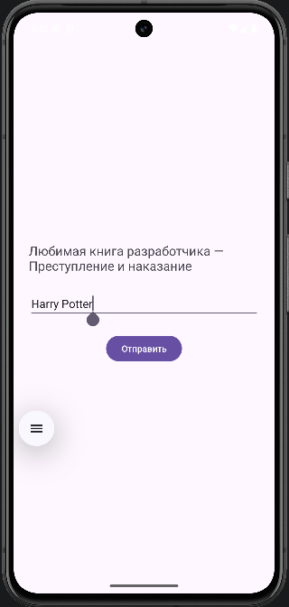

После возврата в MainActivity в колбэке ActivityResultCallback извлекалось название книги пользователя, после чего текст на первом экране обновлялся и содержал уже конкретный результат.

**Рисунок 9: Главный экран модуля FavoriteBook после возврата результата из ShareActivity.**
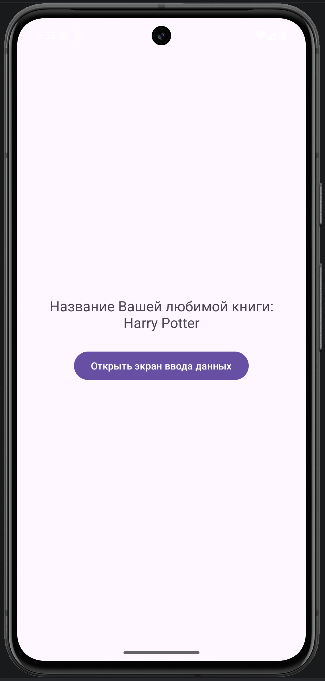

Для реализации пользовательского интерфейса были подготовлены две разметки: первая — для отображения итогового текста и кнопки, вторая — для отображения книги разработчика, поля ввода и кнопки отправки.


**Файл `activity_main.xml`:**
```xml
<?xml version="1.0" encoding="utf-8"?>
<LinearLayout xmlns:android="http://schemas.android.com/apk/res/android"
    android:layout_width="match_parent"
    android:layout_height="match_parent"
    android:gravity="center"
    android:orientation="vertical"
    android:padding="24dp">

    <TextView
        android:id="@+id/textViewBook"
        android:layout_width="wrap_content"
        android:layout_height="wrap_content"
        android:layout_marginBottom="24dp"
        android:text="Тут появится название вашей любимой книги!"
        android:textAlignment="center"
        android:textSize="20sp" />

    <Button
        android:layout_width="wrap_content"
        android:layout_height="wrap_content"
        android:onClick="getInfoAboutBook"
        android:text="Открыть экран ввода данных" />

</LinearLayout>
```


**Файл `activity_share.xml`:**
```xml
<?xml version="1.0" encoding="utf-8"?>
<LinearLayout xmlns:android="http://schemas.android.com/apk/res/android"
    android:layout_width="match_parent"
    android:layout_height="match_parent"
    android:gravity="center"
    android:orientation="vertical"
    android:padding="24dp">

    <TextView
        android:id="@+id/textViewDeveloperBook"
        android:layout_width="wrap_content"
        android:layout_height="wrap_content"
        android:layout_marginBottom="24dp"
        android:textSize="20sp" />

    <EditText
        android:id="@+id/editTextUserBook"
        android:layout_width="match_parent"
        android:layout_height="wrap_content"
        android:hint="Введите название вашей любимой книги" />

    <Button
        android:layout_width="wrap_content"
        android:layout_height="wrap_content"
        android:layout_marginTop="24dp"
        android:onClick="sendBookName"
        android:text="Отправить" />

</LinearLayout>
```

Итогом данного задания стала реализация обмена данными между двумя активностями с последующим возвратом результата на исходный экран, что соответствует заданию на использование двух экранов и передачи любимой книги пользователя обратно в родительскую активность.

---

### 3.4. Модуль SystemIntentsApp — вызов системных приложений

Далее был создан модуль SystemIntentsApp, предназначенный для изучения неявных намерений, запускающих системные приложения Android. По условию задания необходимо было реализовать три кнопки: для открытия окна набора номера, для открытия веб-страницы в браузере и для отображения координат на карте. Для корректного открытия карты использовался эмулятор с образом Google APIs, как указано в методических материалах.

В MainActivity были реализованы три метода обработки нажатий. В методе onClickCall() создавался Intent с действием ACTION_DIAL, в который передавался URI телефона. В методе onClickOpenBrowser() создавался Intent с действием ACTION_VIEW и URI на сайт developer.android.com. В методе onClickOpenMaps() также создавался Intent с действием ACTION_VIEW, но уже с URI вида geo:широта,долгота.


**Листинг `MainActivity.java`:**
```java
package com.mirea.Samsonova.systemintentsapp;

import android.content.Intent;
import android.net.Uri;
import android.os.Bundle;
import android.view.View;

import androidx.appcompat.app.AppCompatActivity;

public class MainActivity extends AppCompatActivity {
    @Override
    protected void onCreate(Bundle savedInstanceState) {
        super.onCreate(savedInstanceState);
        setContentView(R.layout.activity_main);
    }
    public void onClickCall(View view) {
        Intent intent = new Intent(Intent.ACTION_DIAL);
        intent.setData(Uri.parse("tel:89811112233"));
        startActivity(intent);
    }
    public void onClickOpenBrowser(View view) {
        Intent intent = new Intent(Intent.ACTION_VIEW);
        intent.setData(Uri.parse("http://developer.android.com"));
        startActivity(intent);
    }
    public void onClickOpenMaps(View view) {
        Intent intent = new Intent(Intent.ACTION_VIEW);
        intent.setData(Uri.parse("geo:55.749479,37.613944"));
        startActivity(intent);
    }
}
```

На главном экране модуля были размещены три кнопки, каждая из которых была связана со своим методом через атрибут android:onClick.


**Файл `activity_main.xml`:**
```xml
<?xml version="1.0" encoding="utf-8"?>
<LinearLayout xmlns:android="http://schemas.android.com/apk/res/android"
    android:layout_width="match_parent"
    android:layout_height="match_parent"
    android:gravity="center"
    android:orientation="vertical">

    <Button
        android:layout_width="wrap_content"
        android:layout_height="wrap_content"
        android:onClick="onClickCall"
        android:text="позвонить" />

    <Button
        android:layout_width="wrap_content"
        android:layout_height="wrap_content"
        android:layout_marginTop="16dp"
        android:onClick="onClickOpenBrowser"
        android:text="открыть браузер" />

    <Button
        android:layout_width="wrap_content"
        android:layout_height="wrap_content"
        android:layout_marginTop="16dp"
        android:onClick="onClickOpenMaps"
        android:text="открыть карту" />

</LinearLayout>
```

**Рисунок 10: Главный экран модуля SystemIntentsApp с тремя кнопками.**
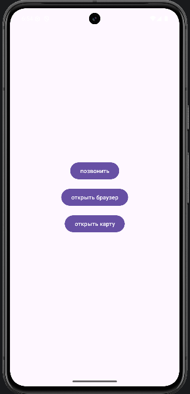

После нажатия на первую кнопку открывался номеронабиратель с уже подставленным номером телефона.

**Рисунок 11: Открытое системное приложение для набора номера.**
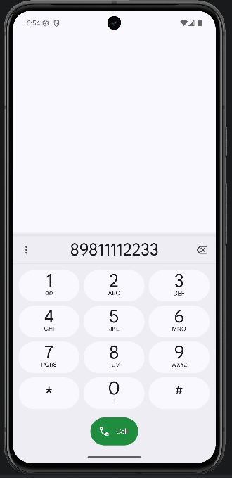

После нажатия на вторую кнопку открывался браузер со страницей разработческой документации Android.

**Рисунок 12: Открытая страница в браузере после вызова ACTION_VIEW.**
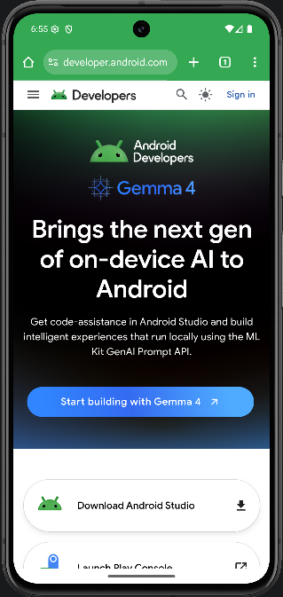

После нажатия на третью кнопку открывалось картографическое приложение с центром в указанных координатах.

**Рисунок 13: Отображение координат на карте через системное приложение карт.**
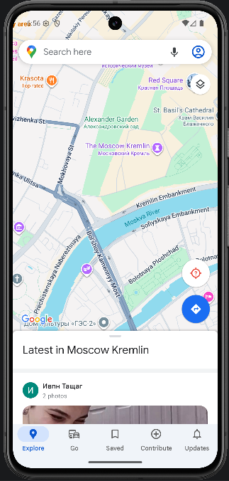

В результате в данном модуле были изучены типовые примеры использования неявных намерений для делегирования задач системе Android и сторонним приложениям.

---

### 3.5. Модуль SimpleFragmentApp — работа с фрагментами и ориентацией экрана

Следующим этапом была реализация модуля SimpleFragmentApp, посвящённого работе с фрагментами. Согласно заданию, необходимо было создать два фрагмента — FirstFragment и SecondFragment, реализовать их отображение внутри активности и обеспечить корректную работу интерфейса как в портретной, так и в горизонтальной ориентации экрана. В портретном режиме должен был использоваться контейнер FrameLayout и переключение фрагментов по кнопкам, а в горизонтальном режиме оба фрагмента должны были отображаться одновременно.

Сначала были созданы два пустых фрагмента через мастер Android Studio: FirstFragment и SecondFragment. Затем их исходный код был упрощён: каждый фрагмент стал наследоваться от Fragment и переопределять метод onCreateView(), возвращающий соответствующую XML-разметку.


**Листинг `FirstFragment.java`:**
```java
package com.mirea.Samsonova.simplefragmentapp;

import android.os.Bundle;
import android.view.LayoutInflater;
import android.view.View;
import android.view.ViewGroup;

import androidx.fragment.app.Fragment;

public class FirstFragment extends Fragment {

    public FirstFragment() {
    }

    @Override
    public View onCreateView(LayoutInflater inflater, ViewGroup container,
                             Bundle savedInstanceState) {
        return inflater.inflate(R.layout.fragment_first, container, false);
    }
}
```


**Листинг `SecondFragment.java`:**
```java
package com.mirea.Samsonova.simplefragmentapp;

import android.os.Bundle;
import android.view.LayoutInflater;
import android.view.View;
import android.view.ViewGroup;

import androidx.fragment.app.Fragment;

public class SecondFragment extends Fragment {

    public SecondFragment() {
    }

    @Override
    public View onCreateView(LayoutInflater inflater, ViewGroup container,
                             Bundle savedInstanceState) {
        return inflater.inflate(R.layout.fragment_second, container, false);
    }
}
```

Для каждого фрагмента была подготовлена собственная разметка. В одном случае использовался фиолетовый фон, в другом — бирюзовый. Это позволяло визуально отличать фрагменты друг от друга при запуске приложения.


**Файл `fragment_first.xml`:**
```xml
<?xml version="1.0" encoding="utf-8"?>
<FrameLayout xmlns:android="http://schemas.android.com/apk/res/android"
    android:layout_width="match_parent"
    android:layout_height="match_parent"
    android:background="#BB86FC">

    <TextView
        android:layout_width="match_parent"
        android:layout_height="match_parent"
        android:gravity="center"
        android:text="FirstFragment"
        android:textColor="#FFFFFF"
        android:textSize="28sp" />

</FrameLayout>
```


**Файл `fragment_second.xml`:**
```xml
<?xml version="1.0" encoding="utf-8"?>
<FrameLayout xmlns:android="http://schemas.android.com/apk/res/android"
    android:layout_width="match_parent"
    android:layout_height="match_parent"
    android:background="#03DAC5">

    <TextView
        android:layout_width="match_parent"
        android:layout_height="match_parent"
        android:gravity="center"
        android:text="SecondFragment"
        android:textColor="#000000"
        android:textSize="28sp" />

</FrameLayout>
```

В MainActivity были созданы экземпляры обоих фрагментов. В методе onCreate() по умолчанию в контейнер fragmentContainer загружался первый фрагмент. Далее был реализован метод onClick(View view), который в зависимости от нажатой кнопки заменял содержимое контейнера либо на FirstFragment, либо на SecondFragment. В процессе доработки также была учтена разница между портретной и горизонтальной ориентацией: если контейнер fragmentContainer отсутствовал в layout-land, то обработчик просто ничего не делал, так как в альбомной ориентации оба фрагмента уже были встроены в разметку.


**Листинг `MainActivity.java`:**
```java
package com.mirea.Samsonova.simplefragmentapp;

import android.os.Bundle;
import android.view.View;

import androidx.appcompat.app.AppCompatActivity;
import androidx.fragment.app.Fragment;

public class MainActivity extends AppCompatActivity {

    private Fragment firstFragment;
    private Fragment secondFragment;

    @Override
    protected void onCreate(Bundle savedInstanceState) {
        super.onCreate(savedInstanceState);
        setContentView(R.layout.activity_main);

        firstFragment = new FirstFragment();
        secondFragment = new SecondFragment();

        if (savedInstanceState == null && findViewById(R.id.fragmentContainer) != null) {
            getSupportFragmentManager()
                    .beginTransaction()
                    .replace(R.id.fragmentContainer, firstFragment)
                    .commit();
        }
    }

    public void onClick(View view) {
        if (findViewById(R.id.fragmentContainer) == null) {
            return;
        }

        int id = view.getId();

        if (id == R.id.btnFirstFragment) {
            getSupportFragmentManager()
                    .beginTransaction()
                    .replace(R.id.fragmentContainer, firstFragment)
                    .commit();
        } else if (id == R.id.btnSecondFragment) {
            getSupportFragmentManager()
                    .beginTransaction()
                    .replace(R.id.fragmentContainer, secondFragment)
                    .commit();
        }
    }
}
```


Для портретной ориентации в res/layout/activity_main.xml была создана разметка с двумя кнопками и контейнером FrameLayout, в который динамически подгружались фрагменты.


**Файл `SimpleFragmentApp/src/main/res/layout/activity_main.xml`:**
```xml
<?xml version="1.0" encoding="utf-8"?>
<LinearLayout xmlns:android="http://schemas.android.com/apk/res/android"
    android:layout_width="match_parent"
    android:layout_height="match_parent"
    android:orientation="vertical"
    android:padding="16dp">

    <LinearLayout
        android:layout_width="match_parent"
        android:layout_height="wrap_content"
        android:gravity="center"
        android:orientation="horizontal">

        <Button
            android:id="@+id/btnFirstFragment"
            android:layout_width="wrap_content"
            android:layout_height="wrap_content"
            android:onClick="onClick"
            android:text="fragment1" />

        <Button
            android:id="@+id/btnSecondFragment"
            android:layout_width="wrap_content"
            android:layout_height="wrap_content"
            android:layout_marginStart="16dp"
            android:onClick="onClick"
            android:text="fragment2" />
    </LinearLayout>

    <FrameLayout
        android:id="@+id/fragmentContainer"
        android:layout_width="match_parent"
        android:layout_height="0dp"
        android:layout_marginTop="16dp"
        android:layout_weight="1" />

</LinearLayout>
```


**Рисунок 14: Экран модуля SimpleFragmentApp в портретной ориентации с первым фрагментом.**
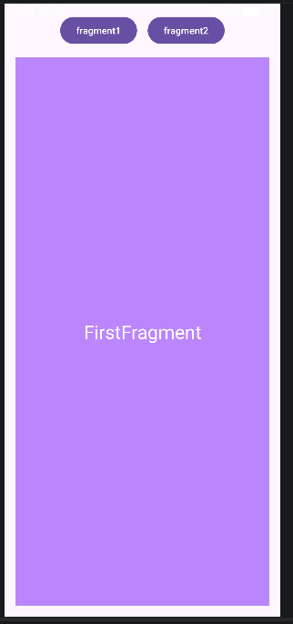

После нажатия на вторую кнопку происходила замена первого фрагмента на второй.

**Рисунок 15: Экран модуля SimpleFragmentApp в портретной ориентации после переключения на второй фрагмент.**
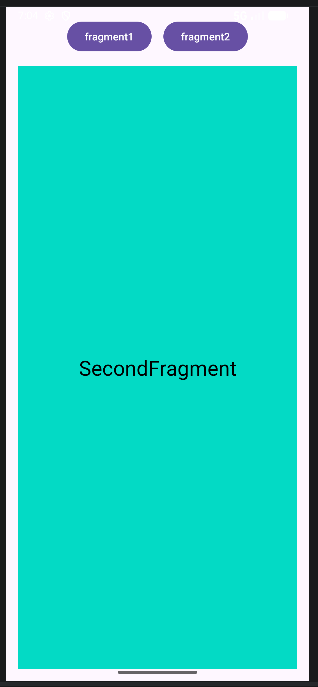

Для горизонтальной ориентации был создан отдельный файл res/layout-land/activity_main.xml. В нём два фрагмента были добавлены в разметку напрямую через теги <fragment>, благодаря чему оба экрана отображались одновременно, без использования контейнера fragmentContainer.


**Файл `SimpleFragmentApp/src/main/res/layout-land/activity_main.xml`:**
```xml
<?xml version="1.0" encoding="utf-8"?>
<LinearLayout xmlns:android="http://schemas.android.com/apk/res/android"
    android:layout_width="match_parent"
    android:layout_height="match_parent"
    android:orientation="horizontal">

    <fragment
        android:id="@+id/fragmentLeft"
        android:name="com.mirea.Samsonova.simplefragmentapp.FirstFragment"
        android:layout_width="0dp"
        android:layout_height="match_parent"
        android:layout_weight="1" />

    <fragment
        android:id="@+id/fragmentRight"
        android:name="com.mirea.Samsonova.simplefragmentapp.SecondFragment"
        android:layout_width="0dp"
        android:layout_height="match_parent"
        android:layout_weight="1" />

</LinearLayout>
```

**Рисунок 16: Экран модуля SimpleFragmentApp в горизонтальной ориентации с одновременным отображением двух фрагментов.**
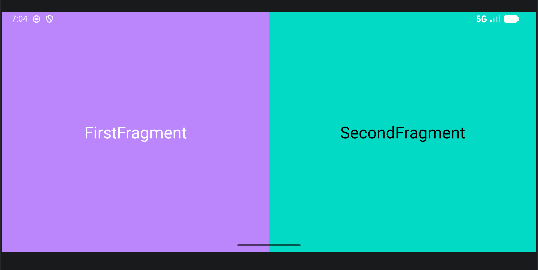

Таким образом, в данном модуле были изучены два способа работы с фрагментами: динамическая замена фрагмента внутри контейнера и статическое размещение нескольких фрагментов в альтернативной разметке для другой ориентации. Это полностью соответствует заданию раздела про Fragment и изменение ориентации экрана.

---

## 3.6. Контрольное задание — проект MireaProject

После выполнения основных модулей был создан отдельный проект MireaProject. В методических указаниях предлагается использовать шаблон Navigation Drawer Activity, однако в используемой версии Android Studio данный шаблон отсутствовал для языка Java, а доступный вариант Navigation UI Activity реализован только на Kotlin. В связи с этим проект был создан на основе шаблона Empty Views Activity, а вся структура приложения с боковой навигационной шторкой была реализована вручную средствами Java и XML-разметки.

На первом этапе в проект были добавлены необходимые зависимости библиотеки Navigation (navigation-fragment и navigation-ui), обеспечивающие работу навигации между фрагментами. Также в файл AndroidManifest.xml было добавлено разрешение на использование сети Интернет, необходимое для работы встроенного браузера.

Далее была реализована главная активность MainActivity, в которой была вручную настроена структура бокового меню. Для этого в разметке activity_main.xml был использован корневой контейнер DrawerLayout, содержащий Toolbar, контейнер FragmentContainerView с NavHostFragment, а также элемент NavigationView, отвечающий за отображение боковой навигационной панели.


**Файл `MireaProject/app/src/main/res/layout/activity_main.xml`:**
```xml
<?xml version="1.0" encoding="utf-8"?>
<LinearLayout xmlns:android="http://schemas.android.com/apk/res/android"
    android:layout_width="match_parent"
    android:layout_height="match_parent"
    android:orientation="horizontal">

    <fragment
        android:id="@+id/fragmentLeft"
        android:name="com.mirea.Samsonova.simplefragmentapp.FirstFragment"
        android:layout_width="0dp"
        android:layout_height="match_parent"
        android:layout_weight="1" />

    <fragment
        android:id="@+id/fragmentRight"
        android:name="com.mirea.Samsonova.simplefragmentapp.SecondFragment"
        android:layout_width="0dp"
        android:layout_height="match_parent"
        android:layout_weight="1" />

</LinearLayout>
```


В классе MainActivity был получен объект NavController через NavHostFragment, после чего была выполнена привязка навигации к боковому меню и панели инструментов с помощью методов NavigationUI.setupWithNavController() и NavigationUI.setupActionBarWithNavController(). Также был добавлен ActionBarDrawerToggle для управления открытием и закрытием боковой шторки.


**Листинг `MainActivity.java`:**
```java
package com.mirea.Samsonova.mireaproject;

import android.os.Bundle;
import android.view.Menu;

import androidx.appcompat.app.ActionBarDrawerToggle;
import androidx.appcompat.app.AppCompatActivity;
import androidx.appcompat.widget.Toolbar;
import androidx.drawerlayout.widget.DrawerLayout;
import androidx.navigation.NavController;
import androidx.navigation.fragment.NavHostFragment;
import androidx.navigation.ui.AppBarConfiguration;
import androidx.navigation.ui.NavigationUI;

import com.google.android.material.navigation.NavigationView;

public class MainActivity extends AppCompatActivity {

    private AppBarConfiguration mAppBarConfiguration;
    private DrawerLayout drawerLayout;
    private NavigationView navigationView;
    private Toolbar toolbar;
    private NavController navController;

    @Override
    protected void onCreate(Bundle savedInstanceState) {
        super.onCreate(savedInstanceState);
        setContentView(R.layout.activity_main);

        toolbar = findViewById(R.id.toolbar);
        setSupportActionBar(toolbar);

        drawerLayout = findViewById(R.id.drawer_layout);
        navigationView = findViewById(R.id.nav_view);

        NavHostFragment navHostFragment =
                (NavHostFragment) getSupportFragmentManager()
                        .findFragmentById(R.id.nav_host_fragment_content_main);

        if (navHostFragment == null) {
            throw new IllegalStateException("NavHostFragment not found");
        }

        navController = navHostFragment.getNavController();

        mAppBarConfiguration = new AppBarConfiguration.Builder(
                R.id.nav_home,
                R.id.nav_data,
                R.id.nav_webview
        ).setOpenableLayout(drawerLayout).build();

        NavigationUI.setupActionBarWithNavController(this, navController, mAppBarConfiguration);
        NavigationUI.setupWithNavController(navigationView, navController);

        ActionBarDrawerToggle toggle = new ActionBarDrawerToggle(
                this,
                drawerLayout,
                toolbar,
                R.string.navigation_drawer_open,
                R.string.navigation_drawer_close
        );
        drawerLayout.addDrawerListener(toggle);
        toggle.syncState();
    }

    @Override
    public boolean onCreateOptionsMenu(Menu menu) {
        getMenuInflater().inflate(R.menu.main, menu);
        return true;
    }

    @Override
    public boolean onSupportNavigateUp() {
        return NavigationUI.navigateUp(navController, mAppBarConfiguration)
                || super.onSupportNavigateUp();
    }
}
```

Для организации навигации был создан файл графа навигации mobile_navigation.xml, в котором были объявлены три фрагмента:

- HomeFragment — стартовый экран;
- DataFragment — экран с информацией об отрасли;
- WebViewFragment — экран со встроенным браузером.

Каждый фрагмент был связан с соответствующим пунктом меню через уникальный идентификатор.


**Файл `MireaProject/app/src/main/res/navigation/mobile_navigation.xml`:**
```xml
<?xml version="1.0" encoding="utf-8"?>
<navigation xmlns:android="http://schemas.android.com/apk/res/android"
    xmlns:app="http://schemas.android.com/apk/res-auto"
    xmlns:tools="http://schemas.android.com/tools"
    android:id="@+id/mobile_navigation"
    app:startDestination="@id/nav_home">

    <fragment
        android:id="@+id/nav_home"
        android:name="com.mirea.Samsonova.mireaproject.ui.home.HomeFragment"
        android:label="@string/menu_home"
        tools:layout="@layout/fragment_home" />

    <fragment
        android:id="@+id/nav_data"
        android:name="com.mirea.Samsonova.mireaproject.ui.data.DataFragment"
        android:label="@string/menu_data"
        tools:layout="@layout/fragment_data" />

    <fragment
        android:id="@+id/nav_webview"
        android:name="com.mirea.Samsonova.mireaproject.ui.webview.WebViewFragment"
        android:label="@string/menu_webview"
        tools:layout="@layout/fragment_web_view" />
</navigation>
```

Для отображения пунктов бокового меню был создан файл activity_main_drawer.xml, в котором были описаны элементы навигации. Каждый пункт меню соответствовал одному из фрагментов.


**Файл `MireaProject/app/src/main/res/menu/activity_main_drawer.xml`:**
```xml
<?xml version="1.0" encoding="utf-8"?>
<menu xmlns:android="http://schemas.android.com/apk/res/android">

    <group android:checkableBehavior="single">

        <item
            android:id="@+id/nav_home"
            android:icon="@android:drawable/ic_menu_view"
            android:title="@string/menu_home" />

        <item
            android:id="@+id/nav_data"
            android:icon="@android:drawable/ic_menu_info_details"
            android:title="@string/menu_data" />

        <item
            android:id="@+id/nav_webview"
            android:icon="@android:drawable/ic_menu_search"
            android:title="@string/menu_webview" />

    </group>
</menu>
```

Также был создан заголовок бокового меню nav_header_main.xml, содержащий название приложения и информацию о разработчике.


**Файл `MireaProject/app/src/main/res/layout/nav_header_main.xml`:**
```xml
<?xml version="1.0" encoding="utf-8"?>
<LinearLayout xmlns:android="http://schemas.android.com/apk/res/android"
    android:layout_width="match_parent"
    android:layout_height="160dp"
    android:background="?attr/colorPrimary"
    android:gravity="bottom"
    android:orientation="vertical"
    android:padding="16dp">

    <TextView
        android:layout_width="wrap_content"
        android:layout_height="wrap_content"
        android:text="MireaProject"
        android:textColor="@android:color/white"
        android:textSize="24sp"
        android:textStyle="bold" />

    <TextView
        android:layout_width="wrap_content"
        android:layout_height="wrap_content"
        android:layout_marginTop="8dp"
        android:text="Самсонова Ольга Павловна"
        android:textColor="@android:color/white"
        android:textSize="16sp" />

</LinearLayout>
```

**Рисунок 17: Главное окно проекта MireaProject с открытой боковой навигационной шторкой.**
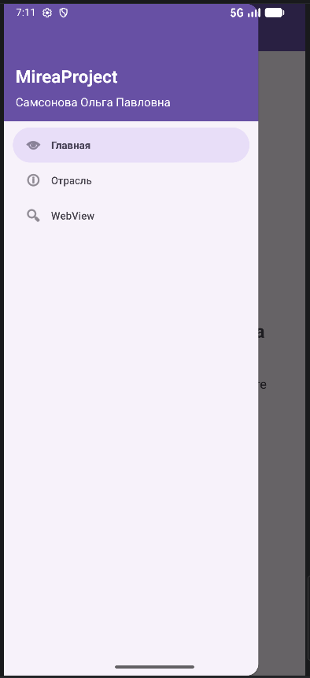

---

### Реализация DataFragment

В рамках контрольного задания был реализован фрагмент DataFragment, содержащий информацию об выбранной отрасли. В качестве темы была выбрана кибербезопасность.

Экран был оформлен с использованием NestedScrollView и компонентов MaterialCardView, что позволило структурировать информацию на отдельные блоки:

- описание отрасли;
- основные направления;
- значимость отрасли.


**Листинг `MireaProject/app/src/main/java/.../ui/data/DataFragment.java`:**
```java
package com.mirea.Samsonova.mireaproject.ui.data;

import android.os.Bundle;
import android.view.LayoutInflater;
import android.view.View;
import android.view.ViewGroup;

import androidx.fragment.app.Fragment;

import com.mirea.Samsonova.mireaproject.R;

public class DataFragment extends Fragment {

    public DataFragment() {
    }

    @Override
    public View onCreateView(LayoutInflater inflater, ViewGroup container,
                             Bundle savedInstanceState) {
        return inflater.inflate(R.layout.fragment_data, container, false);
    }
}
```


**Файл `MireaProject/app/src/main/res/layout/fragment_data.xml`:**
```xml
<?xml version="1.0" encoding="utf-8"?>
<androidx.core.widget.NestedScrollView xmlns:android="http://schemas.android.com/apk/res/android"
    xmlns:app="http://schemas.android.com/apk/res-auto"
    android:layout_width="match_parent"
    android:layout_height="match_parent"
    android:fillViewport="true">

    <LinearLayout
        android:layout_width="match_parent"
        android:layout_height="wrap_content"
        android:orientation="vertical"
        android:padding="16dp">

        <TextView
            android:layout_width="wrap_content"
            android:layout_height="wrap_content"
            android:layout_marginBottom="12dp"
            android:text="Кибербезопасность"
            android:textSize="28sp"
            android:textStyle="bold" />

        <com.google.android.material.card.MaterialCardView
            android:layout_width="match_parent"
            android:layout_height="wrap_content"
            android:layout_marginBottom="12dp"
            app:cardCornerRadius="20dp">

            <LinearLayout
                android:layout_width="match_parent"
                android:layout_height="wrap_content"
                android:orientation="vertical"
                android:padding="16dp">

                <TextView
                    android:layout_width="wrap_content"
                    android:layout_height="wrap_content"
                    android:text="Что делает отрасль"
                    android:textSize="20sp"
                    android:textStyle="bold" />

                <TextView
                    android:layout_width="match_parent"
                    android:layout_height="wrap_content"
                    android:layout_marginTop="8dp"
                    android:text="Кибербезопасность защищает данные, сети, мобильные приложения, веб-сервисы и облачные системы от атак, утечек и несанкционированного доступа."
                    android:textSize="16sp" />
            </LinearLayout>
        </com.google.android.material.card.MaterialCardView>

        <com.google.android.material.card.MaterialCardView
            android:layout_width="match_parent"
            android:layout_height="wrap_content"
            android:layout_marginBottom="12dp"
            app:cardCornerRadius="20dp">

            <LinearLayout
                android:layout_width="match_parent"
                android:layout_height="wrap_content"
                android:orientation="vertical"
                android:padding="16dp">

                <TextView
                    android:layout_width="wrap_content"
                    android:layout_height="wrap_content"
                    android:text="Основные направления"
                    android:textSize="20sp"
                    android:textStyle="bold" />

                <TextView
                    android:layout_width="match_parent"
                    android:layout_height="wrap_content"
                    android:layout_marginTop="8dp"
                    android:text="• защита сетей&#10;• анализ уязвимостей&#10;• безопасная разработка ПО&#10;• криптография&#10;• мониторинг инцидентов"
                    android:textSize="16sp" />
            </LinearLayout>
        </com.google.android.material.card.MaterialCardView>

        <com.google.android.material.card.MaterialCardView
            android:layout_width="match_parent"
            android:layout_height="wrap_content"
            app:cardCornerRadius="20dp">

            <LinearLayout
                android:layout_width="match_parent"
                android:layout_height="wrap_content"
                android:orientation="vertical"
                android:padding="16dp">

                <TextView
                    android:layout_width="wrap_content"
                    android:layout_height="wrap_content"
                    android:text="Почему эта отрасль важна"
                    android:textSize="20sp"
                    android:textStyle="bold" />

                <TextView
                    android:layout_width="match_parent"
                    android:layout_height="wrap_content"
                    android:layout_marginTop="8dp"
                    android:text="Без кибербезопасности невозможно безопасно хранить персональные данные, проводить онлайн-платежи, пользоваться государственными сервисами и поддерживать работу крупных компаний."
                    android:textSize="16sp" />
            </LinearLayout>
        </com.google.android.material.card.MaterialCardView>

    </LinearLayout>
</androidx.core.widget.NestedScrollView>
```

**Рисунок 18: Экран DataFragment с информацией об отрасли.**
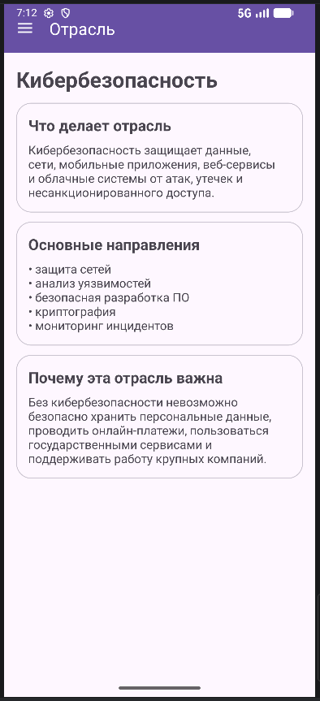

---

### Реализация WebViewFragment

Вторым обязательным элементом контрольного задания стал фрагмент WebViewFragment, реализующий встроенный браузер.

Внутри фрагмента был размещён компонент WebView. В коде были включены необходимые настройки:

- поддержка JavaScript;
- включение DOM Storage;
- установка WebViewClient для загрузки страниц внутри приложения.

В качестве страницы по умолчанию был выбран сайт https://developer.android.com.


**Листинг `MireaProject/app/src/main/java/.../ui/webview/WebViewFragment.java`:**
```java
package com.mirea.Samsonova.mireaproject.ui.webview;

import android.os.Bundle;
import android.view.LayoutInflater;
import android.view.View;
import android.view.ViewGroup;
import android.webkit.WebSettings;
import android.webkit.WebView;
import android.webkit.WebViewClient;

import androidx.fragment.app.Fragment;

import com.mirea.Samsonova.mireaproject.R;

public class WebViewFragment extends Fragment {

    private WebView webView;

    public WebViewFragment() {
    }

    @Override
    public View onCreateView(LayoutInflater inflater, ViewGroup container,
                             Bundle savedInstanceState) {
        View view = inflater.inflate(R.layout.fragment_web_view, container, false);

        webView = view.findViewById(R.id.webView);

        WebSettings webSettings = webView.getSettings();
        webSettings.setJavaScriptEnabled(true);
        webSettings.setDomStorageEnabled(true);

        webView.setWebViewClient(new WebViewClient());
        webView.loadUrl("https://developer.android.com");

        return view;
    }

    @Override
    public void onDestroyView() {
        if (webView != null) {
            webView.destroy();
            webView = null;
        }
        super.onDestroyView();
    }
}
```


**Файл `MireaProject/app/src/main/res/layout/fragment_web_view.xml`:**
```xml
<?xml version="1.0" encoding="utf-8"?>
<FrameLayout xmlns:android="http://schemas.android.com/apk/res/android"
    android:layout_width="match_parent"
    android:layout_height="match_parent">

    <WebView
        android:id="@+id/webView"
        android:layout_width="match_parent"
        android:layout_height="match_parent" />

</FrameLayout>
```

**Рисунок 19: Экран WebViewFragment с открытой веб-страницей по умолчанию.**
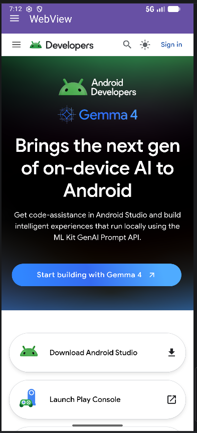

В процессе тестирования было выявлено, что при отсутствии интернет-соединения в эмуляторе страница не загружается и отображается ошибка ERR_NAME_NOT_RESOLVED. После восстановления соединения встроенный браузер начал корректно отображать веб-страницу.

---

### Итог выполнения контрольного задания

В результате выполнения контрольного задания был разработан отдельный проект MireaProject, содержащий:

- боковое навигационное меню (NavigationView);
- навигационный граф (NavController);
- три фрагмента (HomeFragment, DataFragment, WebViewFragment);
- встроенный браузер на основе WebView.

Несмотря на использование шаблона Empty Views Activity, функциональность приложения полностью соответствует требованиям методических указаний, так как структура навигации и взаимодействия экранов была реализована вручную с использованием компонентов библиотеки Navigation.

---

## 4. Результаты работы

Практическая работа №3 выполнена в полном объёме. В ходе выполнения были последовательно реализованы все требуемые по методическим указаниям модули и контрольное задание. В результате работы были закреплены следующие практические навыки.

Во-первых, был изучен механизм явных намерений и передачи данных между активностями на примере модуля IntentApp. Было показано, как передавать в Intent текстовые и числовые данные и затем получать их в другой активности.

Во-вторых, был освоен механизм неявных намерений. В модуле Sharer удалось реализовать как отправку текста в другие приложения через системный chooser, так и приём данных в собственную активность, зарегистрированную через intent-filter. Кроме того, был отработан сценарий выбора данных с возвратом URI в вызывающую активность через Activity Result API.

В-третьих, в модуле FavoriteBook был изучен возврат результата из одной активности в другую, что позволило реализовать полноценный сценарий ввода данных пользователем на втором экране и отображения результата на первом экране.

В-четвёртых, в модуле SystemIntentsApp был закреплён навык использования системных действий Android для вызова внешних приложений: номеронабирателя, браузера и карт.

В-пятых, в модуле SimpleFragmentApp были освоены основы работы с фрагментами, их динамическая замена внутри контейнера и адаптация интерфейса под изменение ориентации экрана за счёт использования отдельной разметки для горизонтального режима.

Наконец, при выполнении контрольного задания был создан отдельный проект MireaProject, в котором были объединены навигационное меню, информационный экран и встроенный браузер на основе WebView, что позволило закрепить навыки создания более сложной многoэкранной структуры приложения.

---


